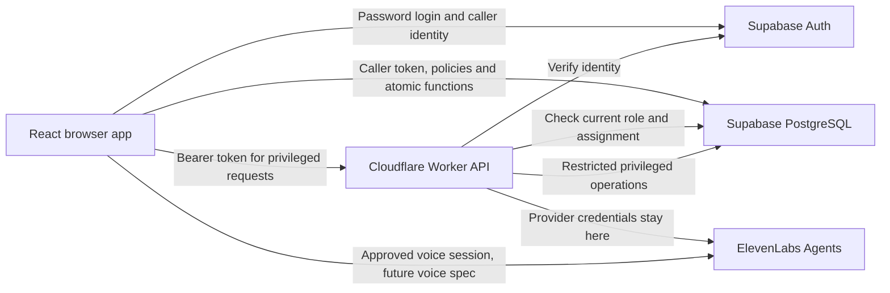

# 0001. Architecture and environments

**Date**: 2026-10-06
**Status**: In Progress

## Summary

Use one React web app and one Cloudflare Worker for the SFDA coach pilot. Supabase owns accounts and player data, while the Worker protects privileged operations and provider credentials. Development runs locally with Docker, production is hosted, and public previews use synthetic fixtures without production access. This decision defines the foundation, while the detailed data model and feature behaviour remain separate work.

## Decision

**Chosen option**: A Vite React application and a small Cloudflare Worker API, with Supabase Auth and PostgreSQL.

You confirmed local development plus production, a public GitHub repository, pnpm, manual database migrations, automatic app deployment from a checked main branch, and authentication held only in memory.

**Content review**: Confirmed by you on 6 October 2026, after the separate critique and both approved fixes. The feature linked status remains Proposed until implementation advances it.

**Permission boundary**: This is design work. It does not authorise scaffolding, account or infrastructure provisioning, migration execution, repository publication or deployment.

## Proposed stack

| Layer | Choice | Reason |
|---|---|---|
| Application shape | One package with clear browser, domain and server modules | A small pilot can share contracts without operating several app services |
| Language | TypeScript with strict checking | Browser and Worker code can share safe data shapes |
| Browser interface | React with Vite and React Router in library mode | The authenticated workspace needs browser navigation and forms |
| Server | Cloudflare Worker using its standard Fetch handler | The initial server surface is small and does not need another HTTP framework |
| Local server runtime | Cloudflare Vite plugin running Worker code in workerd | Local checks exercise the deployed runtime rather than a Node substitute |
| Runtime tooling | Node 24 LTS and pnpm | A supported local toolchain with a committed lockfile |
| Database | Supabase PostgreSQL | Campaigns, assignments and feedback have relational constraints |
| Authentication | Supabase Auth, email and password | Reuse the selected platform rather than implementing authentication |
| Data access | Supabase JavaScript client with database policies and atomic database functions | Ordinary reads and writes retain the caller's identity |
| Schema ownership | Supabase SQL migrations and generated TypeScript database types | SQL owns schema, grants and Row Level Security (per row access rules) |
| Hosting | Workers Static Assets and the API in one deployment | The browser and privileged routes share the same application origin |
| Source and CI | A new public GitHub repository and GitHub Actions | CI (automated checks) can protect the main branch and drive deployment |
| Initial tests | Vitest and Playwright | Logic checks and browser checks remain distinct evidence |
| Later database checks | Real local Supabase policy and constraint tests, before the first pilot | Browser simulations cannot establish actual database permissions |
| Voice integration | ElevenLabs Agents, implemented in its own feature specification | A conversational draft fits the selected coach interaction |
| Observability | Native Cloudflare Worker logs with request IDs and redacted errors | Start with the selected host rather than adding a monitoring service |

The frontend choice follows your request to select after comparing Cloudflare options. React Router library mode, the standard Worker handler and native logs are recommendations to review here. The runners up are a framework with server rendering, a small HTTP framework and a dedicated monitoring service. None is needed to prove the first feedback path.

A future authorised scaffold resolves compatible stable package releases, records exact versions in the lockfile and pins the package manager. Node is tooling, while production code runs in workerd. Record the Worker compatibility date as `2026-10-06`; changing it is a reviewed runtime change. Dependencies need real Worker runtime verification before a Node compatibility flag is added.

Queues, a separate cache, object storage, full text search, server rendering, a second organisation system and an ORM are outside this foundation. Raw audio is not a stored application asset.

## System boundaries

| Boundary | Responsibility |
|---|---|
| Browser modules | Navigation, forms, temporary input, coach review and explicit submission |
| Shared domain modules | Pure data contracts and validation, without secrets or provider credentials |
| Supabase | Identity, authoritative roles and assignments, private feedback, stage rules and atomic final submission |
| Worker modules | Account provisioning and future voice session authorisation, when their feature specifications exist |
| ElevenLabs | Conversation and proposed text, without authority to submit or close a campaign |
| GitHub Actions | Check trusted source, validate release prerequisites and deploy app code |

The database validates the current caller, campaign stage and assignments during writes. A disabled button or a browser count cannot enforce singular final feedback. Privileged keys bypass ordinary database policies, so they never become a general coach data adapter.

Future authenticated Worker routes verify the Supabase user token and current database permission before using an elevated credential. The client cannot choose the actor, role or privileged target scope. Detailed role tables, function names and provisioning transactions are owned by the fresh data model and account specifications.

Use `src/app/` for browser code, `src/domain/` for pure shared contracts and `src/worker/` for the Worker entry and server code. SQL belongs in `supabase/migrations/` and browser checks in `e2e/`. Browser and shared modules cannot import `src/worker/`, and server imports cannot enter the browser bundle. Install dependencies when the relevant slice needs them, rather than installing every future voice or admin library with the scaffold.

## Environments and configuration

There are two data environments. A public preview is a fixture deployment profile, not a third database environment.

| Profile | App runtime | Data and provider behaviour |
|---|---|---|
| Local | Vite with the Cloudflare plugin, local Supabase in Docker | Synthetic data, local Auth and database, provider calls off by default |
| Preview | A separate Cloudflare preview deployment | Synthetic browser fixtures only, no real Auth, database, admin or voice operations |
| Production | The production Worker and one new hosted Supabase project | Provisioned accounts and approved real data, subject to release gates |

The standard local application origin is `http://127.0.0.1:5173`. Supabase connection values come from the local CLI output, rather than copied production settings. Preview mode is an explicit configuration choice. Missing credentials in a local or production live profile produce a configuration error, never an automatic switch to demo data.

| Setting | Source | Exposure and rule |
|---|---|---|
| `APP_ENV` | Deployment profile, `local`, `preview` or `production` | Safe for the browser, never inferred from missing keys |
| `APP_ORIGIN` | Local origin above, generated preview URL or recorded production URL | Allowed login callback origin and server origin checks |
| `RELEASE_ID` | Git commit SHA, or `local` during uncommitted development | Safe identifier for logs and deployed health output |
| `SUPABASE_URL` | Local CLI output or production project settings | Public connection value, absent in preview |
| `SUPABASE_PUBLIC_KEY` | Local CLI output or production project settings | Publishable or anon client key, absent in preview |
| `SUPABASE_ADMIN_KEY` | Local CLI output or production secret key configuration | Server only, available only when an approved privileged feature needs it |
| `ELEVENLABS_API_KEY` | Provider account secret configuration | Worker secret only, introduced by the voice feature |
| `VOICE_ENABLED` | Explicit feature configuration | Defaults to false, preview always false, future harness controls enablement |
| Deployment credentials | GitHub production environment secrets | Trusted deployment job only, never pull request jobs |

The API name `SUPABASE_PUBLIC_KEY` describes its use, not a promise that it grants private access. Database policies and grants still determine what the caller can read. The selected key format must work with the pinned Supabase client and CLI versions.

Public browser configuration comes from a same origin configuration response with an explicit allowlist. It can contain the environment, public Supabase connection values and feature visibility. It never contains an admin key, provider key, deployment token or database password. Runtime configuration is not cached, so a shared static build cannot silently keep another environment's settings.

Production secrets live in Cloudflare secret bindings. Local equivalents live in ignored local files. GitHub holds only the credentials needed by the production deployment job. No real account, player record, private feedback, audio, transcript, credential or environment file with real settings belongs in this public repository, its fixtures or its public check artifacts. Placeholder configuration examples are allowed.

The first production address is the URL Cloudflare generates for the selected Worker on workers.dev. Record that exact URL after authorised provisioning and use it as `APP_ORIGIN`, including the corresponding Supabase login callback allowlist. The actual GitHub owner, repository URL, Worker account and name, Supabase project reference and region are recorded during authorised setup. Use a new Supabase project for version 2, with no shared Auth users, credentials or database migrations from the reference app. The intended new repository name is `sfda-arm-dev`; name availability is not assumed.

## Routing and sessions

The Worker owns `/api/*` routing before the static SPA fallback. SPA (single page application) fallback serves the browser app for valid client routes. An unknown API path returns a JSON error, never the app's HTML. API responses and authenticated data are not cached.

The foundation defines two non sensitive routes. These are boundary contracts, not instructions to build them during this design phase.

| Route | Response and value source | Failure behaviour |
|---|---|---|
| `GET /api/health` | `service: "sfda-arm"`, `appEnv` from `APP_ENV`, `releaseId` from `RELEASE_ID`, `status: "ok"` for a responding Worker | Invalid environment configuration returns `503 CONFIG_INVALID` |
| `GET /api/config` | `appEnv`, `appOrigin`, `releaseId`, public Supabase URL and key in live profiles, and `voiceEnabled` from validated configuration | Live profile without required public settings returns `503 CONFIG_INVALID`; preview returns null Supabase values and `voiceEnabled: false` |
| Unknown `/api/*` | JSON `code: "NOT_FOUND"` and a generated `requestId` | HTTP 404, with no HTML fallback |

Use camel case response names `supabaseUrl` and `supabasePublicKey` for the two public connection values. Errors contain only `code` and `requestId`; request IDs come from `crypto.randomUUID()` at the Worker boundary. All API responses use `Cache-Control: no-store`.

Health establishes that the Worker can respond, not that Auth, the database or ElevenLabs is ready. Later feature specifications name the exact authenticated endpoints and their inputs.

Supabase manages the login and token refresh protocol. Authentication is held only in memory. Tokens do not enter local storage, session storage or app cookies, and sessions are not shared between tabs. Closing or reloading the page loses the app session. While the page remains open, Supabase may refresh its token. Logout clears user context and future active voice capture.

Ordinary data requests carry the current user token through the Supabase client. Privileged API requests carry it in the Authorization header. API calls use the configured application origin, with no wildcard CORS (permission for another site's browser to call the API). Role checks use current database data, not browser state or user editable account metadata.

Missing or expired authentication prevents a write and returns a sign in state. Temporary form text may remain in memory until the page closes, but must not be submitted under a different user after login. Invitation and password reset callback handling is decided in the account specification.

## Delivery and verification policy

Pull requests run build, strict type checks, Vitest and Playwright using synthetic data. They receive no production secrets, including when submitted from the same repository. Fork checks use ordinary pull request workflows, never a privileged workflow that executes untrusted pull request code. Third party CI actions are pinned and reviewed.

Hosted previews are optional and issued only from reviewed code through a trusted workflow or a maintainer's local deployment. Untrusted pull request code never receives a deployment credential. Automatic hosted previews for forks are outside this initial setup.

Cloudflare previews use their own fixture configuration, no Supabase connection values, elevated credentials or provider bindings, and no bindings that call the production Worker. They can prove rendering and routing. They cannot prove real login, database access or voice behaviour. A preview API rejects privileged and live data operations even if the browser is modified.

After trusted main branch checks pass, GitHub Actions automatically deploys the app. Production deployment uses the same checked commit. Failure, missing prerequisites or unknown release readiness stops promotion and keeps the previous version. An initial scaffold can be deployed with no schema dependent features and voice disabled.

Production promotions share one lock for the production Worker, covering prerequisite validation and publication. A running promotion finishes without cancellation. Once a queued candidate acquires the lock, compare its checked commit SHA with the current main branch SHA and skip it if it has been superseded. Recheck that comparison and the required migration versions immediately before publication while holding the lock. All normal production deployments use this same promotion path, so concurrent workflows cannot publish an older queued candidate after a newer release.

You chose manual reviewed database migrations before merging code that requires them. Automatic app deployment does not apply or reverse migrations. When a release depends on migrations, its deployment check compares the required migration versions with the target database history. Missing versions block the Worker deployment. The precise release manifest and check command belong in the verification harness specification.

Schema changes must support both the running app and the next app while deployment is pending. A code rollback returns to a compatible previously deployed Worker version through a separately recorded recovery action coordinated with the same production lock. Removing data or reversing a schema change needs a separate reviewed recovery procedure, not an automatic rollback script.

| Release evidence | Initial policy |
|---|---|
| Build, types, unit and browser checks | Required from the first runnable scaffold |
| Real database permission and constraint tests | Deferred from the initial scaffold, required before the first real player pilot |
| Remote migration prerequisite check | Required whenever the deployed feature depends on migrations |
| Email and password activation delivery | Verified using designated synthetic production smoke accounts before user rollout |
| Live voice quality and privacy | Explicit provider checks and reviewed eval evidence before voice is enabled |
| Real player data permission | Consent, minors, location and retention questions resolved before real data rollout |
| Manual production checks | Recorded separately from local results, using synthetic smoke records |
| GA review | Independent review and release documentation before pilot promotion |

There is no hosted staging environment. Local tests cannot establish production secrets, email delivery, Cloudflare routing or the provider account's settings. New integrations can deploy disabled until their evidence is complete. No automatic deployment should be described as a completed pilot or provider release.

Real database tests can later use the local Supabase test facilities. Their exact cases and tools are decided in the harness specification. The initial Vitest and Playwright suite must clearly distinguish fixtures from actual database behaviour.

## Observability and failures

Worker logs include a generated request ID, a fixed route label, status, elapsed time, environment and release ID. Route labels come from the registered route map: `health`, `config`, approved labels for later endpoints and `unmatched` for every unrecognised route. Never derive a log label from the raw URL, path or query, and never log those raw values. Logs exclude credentials, request bodies, player names, email addresses, feedback, transcripts and audio. Return safe error codes and request IDs to the browser. Do not expose provider responses or exception dumps.

Invalid configuration fails clearly in a live profile. Preview is explicitly fixture only. An unavailable provider leaves manual feedback entry usable. Retry and duplicate submission behaviour is specified at the database boundary by the data model and feedback specifications. Runtime imports are checked in workerd; Node compatibility support does not establish that every Node package works.

## Consequences

You get a small deployment surface and direct use of Supabase's account and database features. You can prove the first real feedback path locally before expanding it.

You also accept more production verification work because there is no hosted staging environment. Memory only sessions require login after a reload. Manual migration ordering must stay in step with automatic app deployment. A public repository requires careful separation of source, fixtures and production credentials.

## Follow-up

* [ ] Complete the fresh data model and access specification before schema or feedback code.
* [ ] Design the harness manifest, migration check, real database test gate and live release evidence.
* [ ] Define account activation, first admin bootstrap, password recovery, current role checks and the minimal player account surface.
* [ ] Define the interface and feedback feature specifications before expanding beyond the foundation.
* [ ] Define ElevenLabs session authorisation, draft return, cancellation and retention verification in the voice specification.
* [ ] Resolve minors, consent, data location and retained text periods before real data or voice rollout.
* [ ] Record the actual repository, hosting and provider identifiers during authorised setup.
* [ ] Capture root and relevant nested agent instructions through the context workflow after an approved scaffold exists.
* [ ] Optional skills, deferred by you: official Cloudflare `cloudflare`, `wrangler` and `workers-best-practices`, Supabase `supabase` and `supabase-postgres-best-practices`, and ElevenLabs `agents` before voice work. No installation is authorised here.
* [ ] Optional MCP, deferred by you: local Supabase first, Cloudflare and ElevenLabs later. No connection is authorised here.

## Rationale

Reasoning, options, source verification and the scope review are in [rationale.md](rationale.md).
