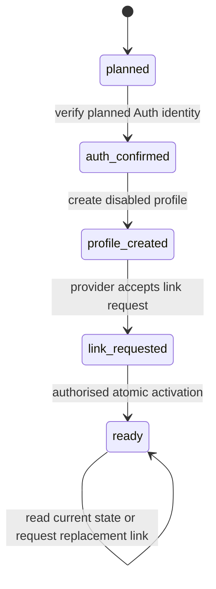

# 0005. First real coach feedback path

**Date**: 2026-10-07
**Status**: Proposed

## Summary

Prove one complete local path from admin setup to a coach reading their saved player feedback. Use real local Supabase accounts and database rules with synthetic people. Connect explicit draft saving, preparation submission and private history to the approved interface. Account setup stays local until a later release proves production onboarding and recovery.

## Requirements

**User stories**

* As an admin, you can provision a coach and player, prepare their campaign and open preparation without sharing their passwords.
* As a coach, you can choose your password, log in, explicitly save unfinished feedback, submit reviewed observations and read them after another login.
* As a future coding agent, you can reproduce this path and its failures with real local accounts, database permissions and recorded verification evidence.

**Acceptance criteria**

* **AC-1**: The complete path works through the local Cloudflare runtime and local Supabase using synthetic people. A trusted local operator establishes the first admin. New account setup endpoints reject preview and production requests before making any privileged provider call.
* **AC-2**: An enabled admin creates coach and player Auth accounts with linked, fixed role profiles and sends password setup links. No admin selects or receives the user's password. Application access is enabled only after account, disabled profile and an accepted link request have been recorded. Pending or failed provisioning grants no work access, including through direct profile activation RPCs.
* **AC-3**: Provisioning has private durable progress. Replaying a request does not create another account, profile, activation or email attempt. An interrupted dispatched attempt remains unknown and requires explicit replacement. Any enabled admin can resume it. A lost Auth creation response is reconciled using its planned UUID and trusted provider marker. An unrelated existing email stops creation and offers the existing application profile for assignment without adopting an orphan account or converting a role.
* **AC-4**: A user explicitly sets a password from a valid setup link through the Worker, then uses normal email and password login. A secret capability authenticates possession of the current application link, so editing an old link's generation cannot restore it. No setup session or token is returned to browser storage. Passwords have at least 12 characters, permit spaces and password managers, and have no required mix of character classes. Invalid or expired links offer an admin replacement path. An unknown password result offers normal login first rather than repeating token consumption automatically.
* **AC-5**: One admin page creates or selects a competition, creates a setup campaign, assigns a provisioned coach and player, and opens preparation through caller authorised database actions. Each step shows its committed result. The stage interface exposes only Open preparation in this slice.
* **AC-6**: A coach's normal login reaches their assigned campaign, roster and preparation editor. Admins reach setup. Players reach their own minimal account status with no player portal. Sessions exist only in memory, and a page reload requires another login without losing committed feedback.
* **AC-7**: Save draft is explicit, supports partial fields and restores the single saved draft on a later login. Draft text is readable only by its author. A stale save rejects the older version and preserves permitted local text for reconciliation. No autosave or offline mutation queue is added.
* **AC-8**: A coach can directly submit reviewed preparation text, or consume their current saved draft, with nonblank observations and an observation date no later than today in Singapore. Optional strengths and development focus remain optional. Submission returns one durable identity and immutable original, appears in the author's history, and persists across sessions. A second distinct preparation submission is allowed.
* **AC-9**: Anonymous, missing profile, disabled account, player, unrelated coach and another author cannot obtain private feedback through UI or direct requests. Admins can read submitted feedback but cannot read drafts. Coach roster reads expose no login email. Direct table writes cannot bypass the required database actions, and existing tokens cannot bypass current account access checks.
* **AC-10**: Same request retries return the original committed result without duplicate feedback or audit events. Changed payloads under the same request ID fail. Unknown outcomes retain the frozen action above the router, block new feedback writes and reconcile through receipts and current reads. Identity loss clears that controller, and late callbacks cannot affect another editor or account.
* **AC-11**: Profile revocation, assignment removal, player withdrawal and a stage change during an editor action obey the existing database permission and lock rules. The editor retains its original feedback kind and becomes read only when appropriate. It does not submit preparation text as final feedback or resurrect a purged draft.
* **AC-12**: Secrets, passwords, setup tokens, raw emails, feedback bodies and raw request paths or queries are absent from logs, public fixtures and retained test artifacts. The provisioning journal stores identifiers, fingerprints and safe progress only. Access changes and significant setup actions have attributed audit events, and draft content does not enter receipts or audits.
* **AC-13**: The preparation readiness profile has real local Auth, database, Worker and browser evidence, with all criteria mapped to meaningful tests or human checks. Invitation compatibility tests pass against pinned dependencies and the actual local Auth runtime. Missing prerequisites remain missing and block readiness. No fixture, production delivery, final campaign or voice evaluation result is misrepresented as proven by this slice.

## Decision

**Chosen option**: Option 2, one local thread through minimal admin setup and the approved coach interface, followed by draft and failure coverage.

Use the stack in [0001](../0001-architecture-environments/index.md), the preparation subset of [0002](../0002-fresh-data-model-access-rules/index.md), the harness contract in [0003](../0003-verification-harness-eval-contract/index.md) and the interface behavior in [0004](../0004-coach-interface-foundation/index.md). This specification adds account setup orchestration and connects those contracts. It does not replace their domain, permission or navigation rules.

**Permission boundary**: Design only. No coding, scaffold, migration execution, account creation, installation, provider connection, repository publication or deployment is authorised by this specification.

**Release boundary**: New account setup is restricted to `APP_ENV=local` and the approved loopback origin. `VOICE_ENABLED=false`. Production email delivery, general password recovery, administrative account management, final stage UI and voice remain later scope work.

**Content review**: You confirmed the completed specification on 7 October 2026, including all eight approved review fixes. Status remains Proposed because the feature is unbuilt.

**Review decisions**: You approved resolutions FP-1 through FP-8 from a different model critique on 7 October 2026. They are incorporated below. The same independent reviewer checked the revised text and confirmed all eight resolved, with no material residual contradiction. Implementation is unstarted.

## Rationale

See [rationale.md](rationale.md) for the alternatives, confirmed answers and verified provider sources.

## Feature design

### Data model sketch

Reuse the core entities in 0002: `profiles`, `competitions`, `campaigns`, `campaign_coaches`, `campaign_players`, `competition_pairings`, preparation `feedback_entries`, `mutation_receipts` and `audit_events`. Auth remains the sole store for email and password. Add the 0002 `final_obligations` freeze storage and its constraints before testing preparation ending. Do not create competing copies or implement final closure merely to finish this thread.

For feature 6, the following approved migration subset takes precedence over the grouping in 0002's build plan, without changing its target model:

| Migration slice | Implemented database capability | Deferred capability |
|---|---|---|
| Core preparation | 0002 core identities, campaigns, memberships, permanent pairings, preparation entries, policies, receipts and audits; setup to preparation transition | Final submission, waiver, correction and closure |
| Private setup | Operation journal and narrow functions below; initial activation guard added to the existing profile access primitive | Production bootstrap and account release |
| Preparation ending | 0002 final_obligations table and compound constraints, campaign freeze fields, setup to preparation and preparation to competition transactions, exact draft purge, frozen scoped reads and no new membership after freeze | Competition to final feedback and final feedback to closed transitions, final writes, waivers and corrections |

The last slice is required before this feature's readiness succeeds. Use the normal enabled admin RPC and real database locks to freeze active pairings and delete drafts, not a fixture update to campaign stage. Other stage advances return `CAPABILITY_UNAVAILABLE` until the later campaign slice implements them. Add final entry fields and constraints when that later slice makes them usable. Correction tables and queries are absent here; history shows the original and a fixed Corrections are not available in this build label, not a fabricated empty correction history.

Add `private.account_setup_operations` in a separate reviewed SQL migration. The schema is outside exposed API schemas. Enable Row Level Security and revoke all direct anonymous and authenticated grants. Only narrow functions below read or mutate it. Unless specified otherwise, fields are required.

| Field | Type and source | Constraint or purpose |
|---|---|---|
| `id`, `mutation_id` | UUID, database ID and initiating browser request ID | Primary key; unique `(requested_by, mutation_id)` |
| `requested_by` | UUID FK `profiles.id` | Enabled admin at initiation, immutable attribution |
| `kind`, `parent_id` | Enum `provision` or `replace_link`; nullable self FK | Provision has no parent; replacement references a provision operation |
| `display_name`, `intended_role` | Validated name and role `coach` or `player` | Immutable intended identity; replacements copy the parent |
| `email_fingerprint`, `request_hash`, `fingerprint_version` | Internal SHA256 hashes and integer 1 | Never raw email; unique email fingerprint for provision operations |
| `planned_auth_id` | UUID allocated before the external create call | Unique among provision operations; not an FK before Auth exists |
| `auth_user_id` | Nullable UUID FK `auth.users.id` | Populated only after the planned identity and trusted marker match |
| `profile_version` | Nullable positive integer | Captured disabled profile version for activation; prevents stale reactivation |
| `checkpoint` | Enum `planned`, `auth_confirmed`, `profile_created`, `link_requested`, `ready` | Last verified completed provisioning step, not an email delivery claim |
| `status`, `safe_error` | Enum `active`, `needs_reconciliation`, `blocked`; nullable allowlisted code | Unknown provider outcome does not erase the checkpoint |
| `setup_generation` | Positive integer, starts at 1 on a provision | Each explicit replacement advances the parent generation atomically; replacement captures that generation |
| `current_link_operation_id` | Nullable self FK, provision only | Initial send sets it to this provision; replacement creation points it to that child immediately |
| `setup_capability_digest` | Nullable hexadecimal SHA256, per link operation | Hash of an unguessable 32 byte capability, set before dispatch; never its raw value |
| `email_attempt_id`, `email_attempt_generation` | Nullable UUID and positive integer | Database allocated once per link operation, bound to the dispatched generation |
| `email_attempt_state`, `email_started_at` | Enum `not_started`, `started`, `accepted`, `unknown`, `failed`; nullable database instant | Durable dispatch intent; started is never redispatched after interruption |
| `version`, `created_at`, `updated_at` | Positive integer and database instants | Optimistic concurrency and durable progress |
| `claim_id`, `claim_until`, `last_resumed_by` | Nullable UUID, database instant, UUID FK `profiles.id` | Short Worker execution claim; last resumer is an enabled admin when claiming |
| `password_setup_at` | Nullable database instant, provision only | Recorded after a known successful password update; absence does not prove that update failed |
| `step_references` | Bounded JSON object, default empty | Fixed profile creation and activation action, actor, request and result references for retry reconciliation |

Replacement rows copy the verified parent identity and role. Their parent must be a provision, and a provision's current link reference must be itself or its own child. Attempt fields are populated together, with not_started requiring no attempt or digest. Once started, attempt ID, generation and digest are immutable for that link operation. Changing the parent's current generation never changes an older operation's recorded attempt generation.

Foreign keys restrict deletion. Retain operations until an approved deletion procedure covers them. Hashes are personal data correlation values, not anonymisation. Normalise email as trimmed lowercase before both Auth calls and fingerprinting. The email fingerprint is hexadecimal SHA256 of that normalised UTF8 string, calculated identically with Worker Web Crypto and database built in SHA256. Use the database version 1 JSON hash contract from 0002 over action, intended name, role, email fingerprint and parent reference as applicable. Never hash or retain the password. Names use the 160 character rule in 0002.

Public progress projections include operation ID, kind, parent reference, intended display name and role, verified target ID, checkpoint, status, version, safe error, generation, current link operation reference, safe email attempt state and timestamps. They omit fingerprints, capability digests, attempt IDs, claims and raw Auth objects. Pending lists order by creation time and ID with cursor paging, default 20 and maximum 100. Existing profile choices use `admin_list_profiles`; they are not an email roster projection.

### State transitions and consistency

`needs_reconciliation` and `blocked` are status flags alongside the checkpoint. A timeout never advances a checkpoint on assumption. A replacement operation uses planned, link_requested and ready, targets the same Auth identity and never creates a profile or enables a disabled account again.

Database changes are strongly consistent under current caller checks and locks. Auth creation, email and password changes occur outside those transactions. There is no atomic commit across Auth and PostgreSQL, and no automatic Auth deletion as compensation. A pending account may exist in Auth while its application profile is absent or disabled.

1. Begin provision with the current enabled admin, fixed request and fingerprint. First check for a matching existing actor and request, returning its operation or `IDEMPOTENCY_CONFLICT` for changed inputs. Then reject an existing unrelated Auth email before reserving a new operation. A concurrent reservation for the same fingerprint returns the existing operation as a conflict for explicit resume. A provider email conflict after reservation remains blocked until verified; it never establishes ownership of the unrelated account.
2. Claim the operation for 30 seconds with its expected version and a database generated claim ID. Each provider call has a 10 second timeout. Reclaim or renew under the same current admin checks before each further call so its budget fits inside the lease. No database lock spans a network call. A live claim blocks another driver with `OPERATION_BUSY`. Expired claims require reconciliation before any further external side effect; service updates require the current claim, version and checkpoint.
3. Before creating, query Auth by `planned_auth_id`. Create with that UUID, no password, `email_confirm=false`, and trusted `app_metadata.sfda_setup_operation_id` equal to the provision ID. Do not store role in provider metadata or use editable `user_metadata` as proof. If the response is lost, resume retrieves the planned UUID and verifies its marker and normalised email fingerprint. A mismatch or inability to establish identity stops with `RECONCILIATION_REQUIRED`. It never adopts by email alone or blindly creates a second account.
4. Record the verified Auth reference. `create_account_setup_profile` uses the 0002 internal profile creation primitive to create its disabled coach or player profile. Commit the profile, captured version, caller keyed receipt, audit, step reference and profile_created checkpoint in one caller authorised database transaction. A lost response leaves either the complete transaction or none of it. A later admin reads the recorded original actor and request reference; they do not replay it under another actor. If no commit exists, the new commit uses the current resumer and records that actor atomically. An existing profile without this operation's committed step, or a changed role, name or access version, requires reconciliation rather than adoption or overwrite.
5. Before every initial or replacement send, fetch the planned Auth user and require its original trusted operation marker, UUID and normalised email fingerprint to match. Identity drift is `RECONCILIATION_REQUIRED`; never silently retarget the reservation. Create the current link capability in Worker memory. Atomically record its digest, a new email attempt ID, generation, current link reference and started state before network dispatch. Only that fresh attempt can dispatch, using the same current claim and generation. Require the invite response's user ID to match; recovery acceptance also requires a matching identity recheck. A known accepted response records accepted and link_requested together. A timeout, crash or abandoned started attempt becomes unknown. It is never redispatched, even if no mail can be proven delivered. The admin can explicitly request a replacement with a new mutation ID. A known rejected attempt becomes failed and likewise requires replacement.
6. Activate only from a verified link_requested checkpoint. Lock and recheck the current admin, operation and target profile. Require the captured disabled profile version. Commit enabled access, its incremented version, ready checkpoint, receipt and access audit together. Never use a stored ready result to reenable an account that an admin subsequently disabled. Refresh current state after any receipt replay.

Profile creation and activation use database allocated per step mutation IDs stored with their actual committing actor and result in step_references. The existing receipt key remains `(actor_id, mutation_id)`. A resumer reconciles an earlier actor's recorded commit through authorised admin reads; each new commit uses their own token and identity. Allocate and store the step ID in the same transaction as its commit, not between a profile call and a later journal write.

Extend the existing `set_profile_access` guard for any profile whose ID matches a provision's planned or confirmed Auth ID. While its provision is not ready, ordinary enable requests fail `ACCOUNT_SETUP_PENDING` at every checkpoint. Initial enablement can occur only inside complete_account_setup after all verified checks, with access, journal, receipt and audit committed together. Revocation remains available with the ordinary required reason. A ready profile can later be explicitly reenabled through the existing admin action with a fresh version and reason; replay or resume of setup never reenables it. Lock caller and target profiles in UUID order, then the operation, consistently in both activation paths to avoid conflicting lock order.

A replacement first validates the parent's verified target. For a ready parent, require the profile still enabled and never repeat activation. For a parent stuck at profile_created after an unknown or failed email result, require its original disabled profile version. In that case a known accepted replacement advances the parent's checkpoint to link_requested, and normal current admin activation can finish it. Reject other profile or checkpoint combinations for reconciliation. Creating the child increments the parent generation atomically with a new request ID, points current_link_operation_id to the child, invalidates the previous claim and immediately invalidates earlier application setup contexts before the new email sends. Use `inviteUserByEmail` for an unconfirmed Auth account and `resetPasswordForEmail` for a confirmed account whose password setup needs another attempt, with the same identity checks and durable attempt protocol. The application handles both invite and recovery token types. Do not add a public forgot password page here. An unknown replacement result requires another deliberate replacement, not automatic resending. The child's ready state means its known link request and any required original activation are complete, not that its user has set a password.

For each actual link operation, generate 32 random bytes with Worker Web Crypto and encode them as base64url `setupCapability`. Store only SHA256 of those bytes in that operation. Include the raw capability only in the provider redirect and email, then the temporary setup form and its POST. Never return it in admin progress or put it in a receipt or log. A replacement has a fresh capability. Lost Worker memory is not a reason to recover or reuse a started attempt; request another replacement. This authenticates possession of the current application email context. It does not claim a cryptographic binding between the capability and Supabase's token hash, and both proofs plus the matching user are required.

Email request success means the provider accepted the request. The local proof separately checks that the message reached the local capture inbox. Exactly once email delivery is not promised across unknown provider responses.

### Provider compatibility gate

Before accepting the implemented path, prove the following against the committed SDK version and actual local Auth runtime:

* `createUser` honours the supplied UUID, preserves trusted `app_metadata`, creates an unconfirmed account without a password and sends no email.
* Inviting that existing unconfirmed account sends a usable invitation and returns the same UUID. It does not create another identity.
* Explicit replacement works before confirmation, and recovery works after verification when password update failed or its outcome was unknown.
* The captured invitation and recovery links support token hash verification in the Worker, password update under that verified session, and normal password login from a separate browser context.
* Expired, consumed and previous generation links cannot start a password update through the application. Changing the old URL's generation or operation ID fails without the current capability, including while replacement dispatch is pending. An already started external update follows the explicit race limitation below; current database access still governs work.

The verified SDK types support an explicit UUID and trusted metadata, but do not establish all server behavior. A failing assertion is a failure, not a missing prerequisite. If any required behavior is unsupported, stop and return to `/architect` to revise the provisioning protocol. Do not add a mail provider, accept a different user UUID, confirm accounts without the link or substitute a mock result.

### API surface

Worker routes use JSON and same origin requests. Required fields are marked req; optional fields opt. Body fields not in the contract are rejected. Admin identity comes from a verified bearer token and current database profile, never the body.

| Endpoint or function | Method | Key inputs | Key outputs | Auth | Key errors |
|---|---|---|---|---|---|
| `/api/admin/accounts` | POST | `mutationId: UUID` req; `email: string` req; `displayName: string` req; `role: coach or player` req | Safe operation projection; existing profile reference on conflict when present | Enabled admin, local only | `EMAIL_EXISTS`, `IDEMPOTENCY_CONFLICT`, `PROVIDER_UNAVAILABLE` |
| `/api/admin/account-operations` | GET | `cursor: string` opt; `pageSize: integer` opt | Safe operations, `nextCursor` | Enabled admin, local only | `FORBIDDEN`, `INVALID_INPUT` |
| `/api/admin/account-operations/{id}` | GET | Operation UUID | Safe current progress and target access status | Enabled admin, local only | `NOT_FOUND`, `FORBIDDEN` |
| `/api/admin/account-operations/{id}/resume` | POST | `mutationId: UUID` req; `expectedVersion: integer` req; `email: string` req when no confirmed Auth reference | Safe updated progress | Enabled admin, local only | `VERSION_CONFLICT`, `OPERATION_BUSY`, `RECONCILIATION_REQUIRED` |
| `/api/admin/account-operations/{id}/setup-link` | POST | `mutationId: UUID` req; `expectedVersion: integer` req | Replacement reference and current generation | Enabled admin, local only | `ACCOUNT_DISABLED`, `VERSION_CONFLICT`, `PROVIDER_UNAVAILABLE` |
| `/api/accounts/setup-password` | POST | `operationId: UUID` req; `generation: integer` req; `setupCapability: base64url` req; `tokenHash: string` req; `type: invite or recovery` req; `password: string` req | `{outcome: password_set}` only | Current application capability and provider proof, local only | `LINK_INVALID`, `ACCOUNT_NOT_READY`, `OUTCOME_UNKNOWN` |
| `begin_account_setup` | POST RPC | Request UUID, intended name, role, email fingerprint | Allocated operation and planned Auth ID | Enabled admin | `IDEMPOTENCY_CONFLICT`, `SETUP_EXISTS` |
| `claim_account_setup` | POST RPC | Operation ID, request UUID, expected version | Safe progress and caller keyed committed or replayed reference; no claim secret | Enabled admin | `VERSION_CONFLICT`, `OPERATION_BUSY` |
| `get_account_setup_progress`, `list_account_setup_operations` | POST RPC | ID, or cursor and page size | Safe authorised progress projection | Enabled admin | `NOT_FOUND`, `INVALID_INPUT` |
| `begin_setup_link_replacement` | POST RPC | Parent ID, request UUID, expected version | Child operation and new generation | Enabled admin | `VERSION_CONFLICT`, `ACCOUNT_DISABLED` |
| `create_account_setup_profile` | POST RPC | Operation ID, expected version | Atomic disabled profile and journal step reference | Enabled admin, verified auth_confirmed checkpoint | `VERSION_CONFLICT`, `RECONCILIATION_REQUIRED` |
| `complete_account_setup` | POST RPC | Operation ID, expected version | Atomic ready reference and current profile version | Enabled admin, verified checkpoint | `VERSION_CONFLICT`, `RECONCILIATION_REQUIRED` |
| `get_my_access`, `admin_list_profiles` | POST RPC | Own access has no inputs; profile list has role, cursor, page size | Own access or bounded profile choices | Caller or enabled admin as in 0002 | `AUTH_REQUIRED`, `FORBIDDEN` |
| `create_competition`, `create_campaign` | POST RPC | Validated names and nullable informational dates; campaign references competition; request UUID | Committed competition or setup campaign reference | Enabled admin | `NAME_CONFLICT`, `INVALID_INPUT` |
| `set_campaign_coach`, `set_campaign_player`, `advance_campaign_stage` | POST RPC | Campaign, target or exact next stage, expected version, reason, request UUID | Committed membership or stage reference | Enabled admin | `PAIR_CONFLICT`, `VERSION_CONFLICT`, `STAGE_CONFLICT` |
| `save_feedback_draft`, `discard_feedback_draft`, `submit_feedback` | POST RPC | Exact inputs and review flag in 0002; kind preparation here | Committed feedback or deleted draft reference | Eligible authoring coach | `VERSION_CONFLICT`, `DRAFT_EXISTS`, `STAGE_CLOSED` |

The setup password body has six fields because both proofs and password must be presented together. Password confirmation remains browser validation and is not sent twice. The database function names are additions to the 0002 catalog. Campaign and feedback requests keep its snake case argument names and result envelope unchanged. The two internal setup step functions use database allocated mutation IDs and committed step references as defined above, rather than a caller invented ID after each network retry.

Service functions are lookup_setup_auth_identity (read only Auth lookup by normalised email fingerprint or planned ID), get_worker_account_setup (private claim and attempt context), record_account_setup_step (claim guarded provider progress and durable attempt start), renew_account_setup_claim (current admin and version checked extension), get_password_setup_context (only the exact link's digest, parent target and current eligibility), and record_password_setup_result (known verified password success). Their exposed RPC signatures grant execution to service_role only and call private implementations. They accept no public caller token substitute and return no raw password, capability, provider token or email. A private claim and attempt ID can be returned only by the admin orchestration lookup, after the Worker verifies the actual caller and matches the current claim owner. The unauthenticated password handler uses its separate service lookup, after environment, origin and limit checks; it receives no admin claim and validates both proofs before updating the user. Caller authorised claim, begin and replacement functions return safe progress and receipt references only. The Worker fetches the verified target's Auth email and rechecks its fingerprint before every send. Reading the managed Auth identity is the only SQL coupling to auth.users; never mutate that managed table directly.

The Worker performs current admin validation before service lookup, claim and each new external side effect. Only the local Worker uses `SUPABASE_ADMIN_KEY`. User authorised functions use a separate client with the actual user's bearer token; they never run under a service role masquerading as that user. A disabled admin cannot complete activation, even if an external request already began. That request may leave a pending Auth account, but grants no work access.

HTTP errors return `{code, requestId, operationId?, conflict?}` with fixed safe messages. The optional conflict field is permitted only for the authorised conflict contracts below. Missing identity is 401, denied role or environment 403, missing or inaccessible operation 404, version, duplicate, busy or reconciliation conflict 409, invalid input 422, local limit 429 and provider timeout or outage 503. A verified provider success with later bookkeeping uncertainty returns `OUTCOME_UNKNOWN`; it never claims rollback. Reads return 200, a ready new provision 201, and pending or unknown progress 202 with its safe projection. Persisted operations remain discoverable after reload through the admin list.

### Exact conflict, retry and value contracts

| Contract | Required source, storage or response |
|---|---|
| Existing application email | `EMAIL_EXISTS` has conflict `{kind: existing_profile, profile: {id, displayName, role, accessEnabled, version}}` from the linked Auth identity and current authorised admin profile projection. If the Auth identity has no profile, conflict is `{kind: auth_identity_unlinked}` with no adopt or assignment action. No raw email is returned. |
| Reserved setup operation | `SETUP_EXISTS` has conflict `{kind: existing_operation, operationId, version}` from the reserved private operation and current enabled admin scope. The UI offers explicit Resume. It does not turn a different creation intent into a successful replay. |
| Initial access reason | The internal activation transaction supplies the fixed reason `Initial account setup completed` from a code constant. It records the current committing admin. This reason never comes from provider metadata. |
| Initial assignment and stage reasons | Admin UI sends the fixed code constants `Initial coach assignment`, `Initial player roster assignment` and `Open preparation for initial feedback` for their respective actions. Subsequent lifecycle changes need the later account interface's explicit reasons. Actual preparation ending tests supply `Synthetic preparation ending check` under the normal admin RPC. |
| Begin, replacement and resume intent | Store the actor and request UUID in 0002 mutation_receipts. Bind action, operation or parent, expected version and named normalised inputs to its version 1 hash. Begin atomically creates the provision and first claim; replacement atomically creates child, advances generation and claims child; resume atomically installs a fresh claim and its receipt. Each returns the ordinary committed or already_committed reference plus refreshed safe progress. |
| Retry driving authority | Only a newly committed begin, replacement or resume intent drives its claimed operation. Replaying that intent refreshes progress but performs no external dispatch and adds no audit. Once an intent's claim is lost or expires, a new explicit Resume intent uses a fresh browser UUID, reconciles prior steps and never redispatches a started email attempt. Claim renewal is service only and adds no user intent or duplicate resume event. |
| Step reconciliation | Profile and activation transactions atomically record their database allocated step ID, actual actor, 0002 receipt and journal reference. A committed step returns its reference after current admin checks; a new step uses the current admin. It never changes the recorded actor to make an old receipt fit. |
| Setup URL identity | operationId is the actual link operation: provision ID for the first email, replacement child ID for a replacement. Resolve its parent provision, then require parent.current_link_operation_id equal that operation, submitted generation equal parent.setup_generation and the operation's accepted email_attempt_generation, and capability digest match. Parent must be ready and its target enabled. A child may have an accepted checkpoint while its bookkeeping ready flag is catching up; parent readiness, current link and accepted attempt are the authority. |
| Password completion attribution | Use the resolved parent target Auth ID as the verified actor; store password_setup_at on the parent. The service recorder's audit dedupe key is `(link operation ID, email attempt generation)`. Neither the password nor either raw proof is retained. |

For initial activation and profile creation, receipt, journal and target updates commit together. For external sends, bind the observation to operation ID, attempt ID, claim ID, expected version and current generation. A late observation after replacement fails and cannot activate the parent. A started attempt abandoned by process termination becomes unknown on reconciliation, even if the provider cannot disclose whether it sent. This conservative outcome requires explicit replacement.

### Password setup, bootstrap and request controls

`/auth/setup` receives operationId, generation, setupCapability, token_hash and type in the provider email URL. Capture them into memory before routing, then remove the entire query with history.replaceState. Do not verify on GET. Set `Referrer-Policy: no-referrer` and `Cache-Control: no-store` on this page and API responses. Render a generic password form without disclosing the email or display name. Reload loses its proofs; reopening an unused current email link is the recovery.

On explicit Set password, resolve and validate the exact current link, its accepted attempt, capability digest, parent readiness and current enabled profile before token consumption. Require a canonical base64url encoding of exactly 32 capability bytes and hash it with Worker Web Crypto. Numeric edits, a missing capability or a previous capability fail LINK_INVALID, including before replacement email dispatch. The Worker calls `verifyOtp({token_hash, type})` using a request scoped public Auth client, matches the returned user to the journal target, then calls `updateUser({password})` under that verified session. It rechecks current link, capability, profile access and generation before updating; an already started external update cannot be rolled back if a later revocation or replacement commits. Current database access remains authoritative either way. No admin password override is used. Drop the temporary client and attempt local session signout in finally; do not claim that this instantly revokes every JWT. Return no access or refresh token, cookie or Auth object to the browser. Success leads to ordinary login.

Count password length in Unicode code points without trimming. Require at least 12 and at most 64 UTF8 bytes, reject control characters, and allow internal or surrounding spaces and paste. Match the local Supabase minimum configuration. The upper bound keeps input within provider hashing limits and must pass the pinned compatibility tests. An expired or invalid proof shows Ask your admin for a replacement. An unknown result shows Try logging in with the password you chose, then request replacement if that fails. No automatic retry consumes a one time proof.

The trusted local bootstrap command validates `APP_ENV=local`, loopback Auth and database targets against current Supabase CLI status, and synthetic identity input. It creates only a missing first admin, links the fixed admin profile and records `admin_bootstrapped`. Reject a conflicting account or existing different administrator rather than overwrite. Obtain its temporary local password through a concealed prompt or ephemeral runtime secret, never a command argument, committed fixture or printed output. No public bootstrap endpoint, database reset or production action exists in this command.

Require the exact configured `APP_ORIGIN` on mutating Worker requests, deny cross origin access and use a 16 KiB request body cap. The unauthenticated password route has an in memory local token bucket of 10 attempts per minute per client and operation, plus 60 per minute globally. Store its client discriminator only in temporary process memory. This limiter is local process protection and is not a production distributed control; the production route is disabled. The later account release must replace that limitation before enabling the route. Admin email actions never automatically retry an unknown send. Ordinary database mutations retain the bounded same request retries in 0002.

### Interface and feedback wiring

Use the components and values from 0004. `/admin/setup` has ordered sections for Accounts, Competition and campaign, Assignments, and Open preparation. Each saves separately, shows its committed identity and reloads current state. Accounts includes the paginated operations list, explicit Resume and Request replacement actions, and existing profile selection on an email conflict. Pending profiles cannot enter assignment choices. Link requested and access enabled are separate labels; neither means the user has finished password setup. A replacement action can invalidate a previous link, so state that effect next to its explicit button.

After normal `signInWithPassword`, call `get_my_access` and route an enabled admin to `/admin/setup`, an enabled coach to `/coach`, and a player to `/account`. Missing and disabled profiles receive an unavailable state. `/account` shows only the caller's safe status and signout. Roles come from the database. Use the memory only Auth client from 0001, including token refresh while the page stays open.

Campaign selection, roster, draft lookup and history are real caller scoped Supabase reads. Paging, content bounds, date sourcing and immutable original history remain as in 0002 and 0004. Corrections are explicitly unavailable in this build; do not query an absent table or report an invented empty result. The later correction slice supplies the original plus latest projection. For this thread the editor writes preparation only, with a blank new observation date and explicit review on Save draft or Submit. Voice is absent while disabled. The actual admin page exposes only Open preparation. Real authorised database tests exercise the implemented preparation to competition freeze and draft purge; final feedback and closure workflows remain missing.

The shared pending action controller, router guard, original phase latch, actor isolation and form locking from 0004 apply to real network calls. Persist neither pending payload nor credentials in browser storage. After reload, inspect saved draft and history before beginning another intent. An absent receipt alone does not prove rollback. Committed results refresh the original subject; they never overwrite whichever player happens to be on screen later.

### Value sourcing

| Action | Value produced or displayed | Source |
|---|---|---|
| Local startup and bootstrap | Environment, allowed origin, Auth and database targets, initial admin | Existing 0001 config, current local CLI status and synthetic operator input |
| Create account | Email, name and intended role | Admin form; email exists transiently then in Auth only; trimmed name and fixed role in operation and profile |
| Begin or replay setup | Actor, operation ID, planned UUID, request identity, checkpoint, generation, times | Verified caller and current profile; database allocation, operation columns and version 1 fingerprint; browser UUID for mutation intent |
| Reconcile Auth | Confirmed identity and email match | Admin Auth getUserById for planned UUID, trusted app_metadata marker and hash of its Auth email |
| Duplicate email | Existing profile choice or blocked orphan | Service lookup of Auth identity and linked profile, followed by caller scoped admin profile projection |
| Resume | Current resumer, claim, previous step results | Current authenticated admin, database claim and operation step reference object |
| Send or replace link | Target email, redirect, type and generation | Verified and fingerprint matched Auth email, APP_ORIGIN plus /auth/setup, actual link operation ID, provider invite or recovery state, parent journal generation |
| Link and dispatch authority | Current capability, its digest, attempt identity and known or unknown send outcome | Worker Web Crypto random bytes; private stored SHA256; database attempt allocation and started state before dispatch; matched provider response or interrupted attempt reconciliation |
| Claim lookup and retry | Private claim, fresh driving authority, safe replay projection | Caller authorised receipt and current private claim; service only lookup after current admin validation; replay does not drive again |
| Activate | Current permission and resulting enabled version | Locked admin and target `profiles` rows, verified operation checkpoint, atomic access receipt |
| Set password | Both proofs, chosen password, target and safe outcome | Current email capability and provider token hash/type in memory; resolved link operation and parent; ephemeral user form; verified Auth update response; only capability digest persisted |
| Login and route | Role, display name, enabled status and session | Supabase password Auth response in memory, then `get_my_access` current profile |
| Admin campaign setup | Competition, campaign, team, optional dates, memberships and stage | Explicit admin inputs, existing selected IDs, committed 0002 RPC results and refreshed rows |
| Audit reasons and conflicts | Initial activation, assignment and stage reasons; selectable conflict references | Fixed code constants and authorised database projections in Exact conflict, retry and value contracts |
| Preparation ending | Frozen pair identities, counts, purge result and paused stage | Real final_obligations and locked advance_campaign_stage transaction, with 0002 audit and receipt counts |
| Coach workspace | Campaign and player context, kind and edit eligibility | Caller scoped campaign, roster and profile reads; preparation kind latched when editor opens |
| Save or resume draft | Content, date, ID and version | Explicitly reviewed form snapshot; author scoped `feedback_entries` lookup and database result |
| Submit and history | Required observation date, Singapore today, original text, author, submission time, correction capability label and receipt | Coach chosen date; database Asia/Singapore date; submitted row, current author identity, database time, fixed unavailable label for this build and mutation receipt |
| Errors and unknown action | Safe code, request ID, frozen subject, committed identity or uncertainty | Allowlisted failure mapping, browser UUID, actor owned pending controller, current receipt and authorised reads |
| Verification report | Runtime versions, pass, fail or missing, evidence and readiness | Committed lockfile, actual local runtime output and 0003 manifest runner; no invented score or provider delivery result |

### Key invariants and security model

* Author, admin, role and permission come from current verified identity and database rows. Every new database write rechecks access inside its transaction. Password setup proof grants only its named password operation, not administrative authority.
* At most one provision operation reserves an email fingerprint. Planned UUID, trusted operation marker and reserved email must match before profile creation and every send. A service email lookup is a private identity check, not permission to adopt or convert that account.
* Direct table writes remain revoked. Policy helpers and service observations have fixed search paths and fully qualified names. Authenticated callers cannot record a provider success, advance a journal checkpoint or read its hashes or claims directly.
* The audit action allowlist gains account_setup_started, account_setup_resumed, setup_link_replacement_started, setup_link_requested and password_setup_completed. Ordinary actor kind is user; only the trusted bootstrap uses bootstrap. Begin, explicit resume and replacement events commit with their caller keyed receipts and are not duplicated on replay. Events contain operation or profile IDs, generations, checkpoints, versions and fixed safe codes, never emails, capability digests, tokens or bodies. Profile and access commits retain their 0002 action events without duplicates. Record one known link request event per attempt. Password completion uses the matched proof target as actor through its service only recorder, with the link operation and attempt generation dedupe key. Nonsecret attempt start and unknown state remain durable in the private journal even when no accepted link event exists.
* Logs use fixed labels `account_create`, `account_operations_list`, `account_operation_read`, `account_resume`, `account_setup_link`, `account_setup_password` and `unmatched_route`. Continue 0001 request ID, status, duration, environment and release fields. Never log raw paths, queries, provider exceptions or bodies.
* Public repository fixtures and CI use synthetic data and disposable local credentials. Sensitive setup tests disable traces, video, automatic screenshots and HTTP body capture while proof and password are present. Keep only sanitised assertions and safe identifiers in retained evidence. Raw local capture email is a temporary local prerequisite, not a published artifact.
* Real people, consent, minors, data location and provider retention remain unresolved release gates. Local synthetic success cannot resolve them.

### Configuration required

Reuse `APP_ENV`, `APP_ORIGIN`, `SUPABASE_URL`, `SUPABASE_PUBLIC_KEY`, `SUPABASE_ADMIN_KEY` and `VOICE_ENABLED` from 0001. No new environment secret, provider, service connection or framework is selected. `APP_ORIGIN` is `http://127.0.0.1:5173` for the approved local web runtime. Derive Supabase and mail capture addresses from CLI status rather than hardcoded ports.

Configure the local Auth allowlist for the setup path and its operation, generation and capability query parameters, without allowing another origin or path. Verify the exact matching behavior in the pinned local Auth tests rather than silently widening the allowlist. Set minimum password length 12 and local mail capture. Email templates carry token hash and invite or recovery type to /auth/setup and preserve the Worker generated redirect's operation, generation and capability. Never insert a bearer session in the template. The capability uses runtime randomness and adds no environment secret. The bootstrap and test tooling receive local service credentials at runtime only. SDK and local runtime versions are pinned and recorded when the authorised scaffold exists.

### Critical test scenarios

| Scenario | Evidence and acceptance criteria |
|---|---|
| Complete thread | Real local bootstrap, admin provision coach and player, captured mail, explicit password setup, campaign assignment, Open preparation, coach submit and second login readback. AC-1, AC-2, AC-4, AC-5, AC-6, AC-8, AC-13 |
| Environment and role guard | Preview and production reject setup before service calls; anonymous, coach, player, disabled admin and forged role cannot administer accounts. AC-1, AC-9, AC-12 |
| Provider compatibility | Assert UUID, metadata, unconfirmed invitation, capability and redirect preservation, replacement, recovery, token hash update and separate browser login against real pinned local Auth. Unsupported behavior fails. AC-2, AC-3, AC-4, AC-13 |
| Partial provisioning | Fail each boundary, lose the profile transaction response and resume as another admin, lose create response, mismatch trusted marker, collide emails, drift Auth email, and reject stale activation after target revocation. Assert complete atomic profile/journal/receipt state, no orphan adoption and no duplicate identity. AC-2, AC-3, AC-9, AC-12 |
| Email process termination | Kill the driver after durable attempt start, after dispatch and before recording acceptance. Resume never redispatches. Explicit replacement creates a fresh child and capability; a stale observation cannot advance or activate it. AC-2, AC-3, AC-4, AC-10, AC-12 |
| Password outcomes | Invalid, expired, consumed and previous generation proofs, edited numeric generation or operation identity, and replacement before dispatch; GET does not consume; double submit and unknown update response; spaces and Unicode bounds; limiter and body limit; no returned session or captured sensitive artifact. AC-4, AC-12, AC-13 |
| Admin setup races | Each step commits separately; repeat request returns its identity; stale campaign or membership version and cross campaign pairing conflict preserve earlier successful steps. No later stage button. AC-5, AC-10, AC-11 |
| Draft lifecycle | Partial explicit save, reload and login resume, newer tab conflict, author only reads, direct submission with and without an existing draft, confirmed draft discard. AC-7, AC-8, AC-9 |
| Submission validation and repeats | Blank observations, invalid or future Singapore date, optional blanks, direct or consumed draft, second distinct preparation feedback, same key retry, changed key payload and immutable history. AC-8, AC-10, AC-12 |
| Permission matrix | Real tokens for author, second assigned coach, unrelated coach, admin, player, disabled and missing profiles, and anonymous direct reads and writes. Deny direct initial profile enablement at every pending checkpoint and authenticated claim/digest reads; preserve revocation and explicit later reactivation rules. Test forbidden email columns and admin draft denial. AC-2, AC-9, AC-12, AC-13 |
| Revocation and unknown outcome | Delay responses, navigate away, sign out and log in as another actor, remove assignment, withdraw player or invoke the actual preparation ending RPC during a pending action. Prove exact freeze, atomic purge and rollback, locks, original kind, receipt reconciliation and no late update or draft resurrection. AC-6, AC-10, AC-11 |
| Conflict and resume contracts | Exact existing profile and operation payloads, fixed reasons, duplicate resume UUID and changed payload, expired intent requiring a new UUID, replacement child URL resolution and parent password completion attribution. No duplicated audit or side effect. AC-3, AC-4, AC-5, AC-10, AC-12 |
| Harness and human checks | Strict preparation profile, clean local reproducibility, existing browser layout matrix, human keyboard and accessibility checks, independent GA review and sanitised evidence. Missing Docker or capture adapter blocks readiness; final and voice profiles remain incomplete. AC-12, AC-13 |

## Build plan

1. Establish the authorised local scaffold and the core preparation migration from 0002, then add the private setup journal migration, exact grants, atomic profile steps, pending activation guard and generated types. Connect the existing 0003 manifest runner. Before relying on the invitation protocol, run its pinned local compatibility tests. Satisfies AC-1, AC-2, AC-3, AC-4, AC-9, AC-12, AC-13.
2. Prove the narrow complete thread: trusted synthetic admin bootstrap, Worker provisioning and password setup, minimal ordered admin page, caller scoped competition and campaign assignment, Open preparation, coach login, one direct reviewed submission and readback after another login. Use real local Auth and database throughout. Satisfies AC-1, AC-2, AC-4, AC-5, AC-6, AC-8, AC-9, AC-12, AC-13.
3. Thicken that working path with explicit saved draft resume and discard, paginated own history, another preparation submission, validation and immutable original projection using the approved interface components. Satisfies AC-6, AC-7, AC-8, AC-9.
4. Add safe progress lists, exact conflicts and reasons, cross admin resume receipts, replacement capabilities, durable email attempts and provider outcome reconciliation. Add meaningful failure injection including process termination and identity drift at external and database boundaries. Satisfies AC-2, AC-3, AC-4, AC-5, AC-9, AC-10, AC-12.
5. Add the preparation ending migration subset with real obligations, atomic freeze and draft purge. Wire the real pending action controller and original phase guards, then prove stale saves, same key retries, direct access denial, account disabling, assignment removal and preparation ending races. Keep correction capability explicitly unavailable. Satisfies AC-7, AC-9, AC-10, AC-11, AC-12.
6. Complete the 0003 preparation profile with local Worker checks, Vitest real database cases, Playwright Chromium and WebKit at both layouts, human accessibility evidence, independent review and release documentation. Record missing later profiles honestly and keep all artifacts sanitised. Satisfies AC-1 through AC-13.

The initial thread needs safe identity, current link capabilities, durable dispatch intent, atomic profile progress and disabled partial provisioning before it runs. Task 4 expands the recovery interface and failure matrix; it does not postpone those invariants. Preparation ending is deliberately pulled forward for real AC-11 evidence. The remaining final campaign migration, correction storage and voice provider implementation belong to their later feature slices.

## Consequences

**Positive**

* You get evidence that accounts, permissions, server calls and feedback storage work together before expanding the product.
* Future agents have explicit recovery rules and one reproducible local thread.

**Negative / tradeoffs**

* Memory only sessions require login after reload, and temporary editor or setup proof is lost.
* Account orchestration adds a private journal and requires real Auth compatibility tests. Email delivery can remain uncertain after a timeout.
* Local proof does not provide a hosted rehearsal environment or production onboarding assurance.

**Neutral**

* This is fresh schema work with no legacy data migration. The SQL target remains 0002 plus the private operation journal here.
* The design remains Proposed until implementation is built and verified. No readiness profile is green merely because this document exists.

## Follow-up

* [ ] Scope feature 7 expands account and roster operations, general password recovery, trusted production admin provisioning, delivery evidence and production request controls before enabling account setup outside local.
* [ ] Scope feature 8 expands the campaign and player workspace after this real path is proven.
* [ ] Scope features 9 and 10 add conversational voice and final campaign completion against their separate readiness gates.
* [ ] Scope feature 11 resolves real data and production release prerequisites, including actual delivery and device evidence. Feature 12 designs approved deletion, including retained setup records.
* [ ] Scope feature 2 captures actual agent context after an authorised scaffold exists. Deferred optional skills and service connections from 0001 remain deferred.
